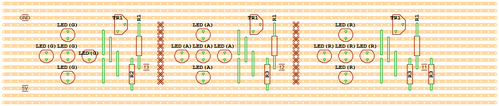

# Arduino Traffic Lights

This repository has the source code and circuit diagrams to build traffic lights.

# Source Code

The source code is uses the Arduino outputs as follows:
- D13: Green light
- D12: Amber light
- D11: Red light
- A0: Analogue input to control traffic light speed

There are three versions of the source code:
1. traffic-light-stand-alone: switches lights in traffic light sequence with speed control
2. traffic-light-transmitter: as per the stand-alone version but also sends commands via serial port to control a second traffic light
3. traffic-light-receiver: version that does not run by itself but switches lights based on commands received from the transmitter version

# Circuit

The circuit diagram was created using www.circuit-diagram.org/ and can be accessed [here](https://crcit.net/c/985ce7fabe784014be060ab223fa8f4e)

Digital output pins 11-13 on the Arduiono are connected to the base of each transistor which are used as switches to drive the LEDs directly from the 5V supply on the Arduino board.
You may need to adjust the values of the current limiting resistors to achieve about the same brightness for each group of LEDs.

A potentiometer is used to provide an input from 0V to 5V to A0 on the Arduino in order to adjust the speed of the traffic light sequence.

# Veroboard

An example veroboard layout is included which groups each set of 5 LEDs together and can be mounted on the inside of a housing.

It was created using VeeCAD which can be downloaded [here](https://veecad.com/downloads.html). The source file is included in the VeeCAD folder.

# Component Listing

TBC
